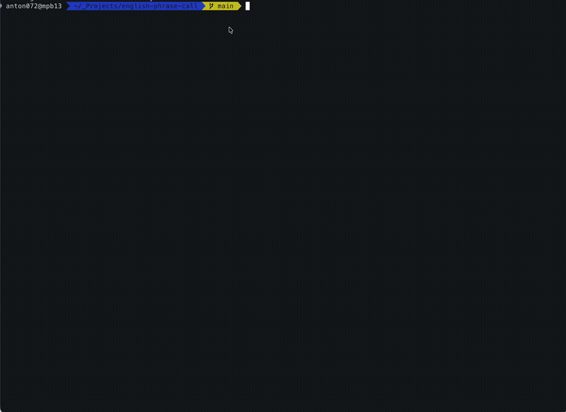

# english-phrase-call

A CLI quiz app that fetches English vocabulary from a Notion database and quizzes you interactively.

## Setup

### 1. Create a Notion Integration

1. Go to https://www.notion.so/my-integrations
2. Create a new integration and copy the API key (`ntn_...`)
3. Open your vocabulary database page in Notion
4. Connect the integration via **... → Connections → Add connection**

### 2. Configure Environment Variables

```bash
cp .env.example .env
```

Edit `.env` and set your values:

```
NOTION_API_KEY=ntn_xxxxx
NOTION_DATABASE_ID=xxxxx-xxxxx-xxxxx
```

### 3. Install Dependencies

```bash
pnpm install
```

## Usage

```bash
pnpm start
```

1. A random English word is displayed (with part of speech and example sentence)
2. Press **Enter** to reveal the Japanese meaning
3. Press **Enter** to move to the next word
4. Press **Ctrl+C** to quit

## Demo



_Replace `./demo.gif` with your actual GIF path (e.g., `./docs/demo.gif`)._

## Notion Database Schema

The app expects a Notion database with the following properties:

| Property | Type         | Description                  |
| -------- | ------------ | ---------------------------- |
| 単語     | Title        | English word or phrase       |
| 意味     | Rich text    | Japanese meaning             |
| 品詞     | Multi-select | Part of speech               |
| 例文     | Rich text    | Example sentence             |
| 例文訳   | Rich text    | Example sentence translation |

## Testing

```bash
pnpm test
```
